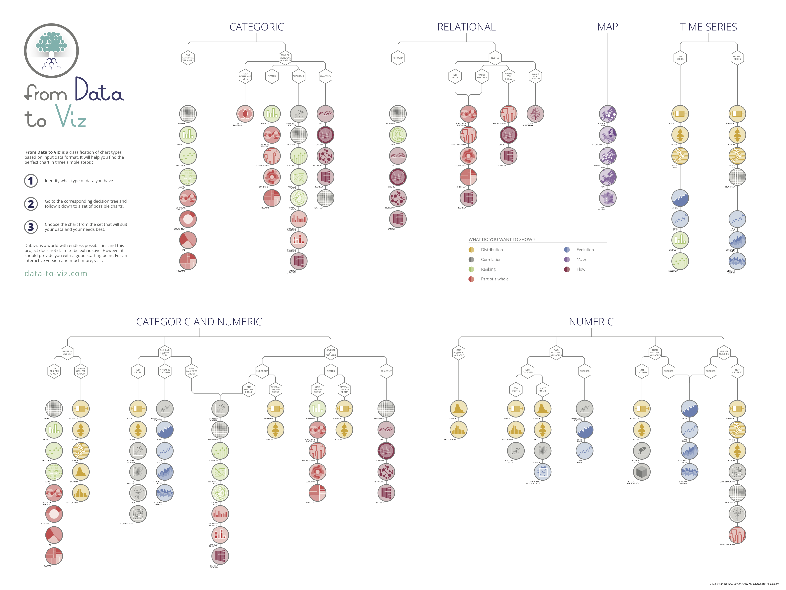

```{=html}
<style>
@import url('https://fonts.googleapis.com/css2?family=Playfair+Display:wght@700;900&family=Source+Sans+3:wght@300;400;600;700&display=swap');

:root {
  --c-bg: #fbf7f0;
  --c-surface: #f0e6d5;
  --c-line: #d6c7af;
  --c-accent: #b88228;
  --c-deep: #1f1a13;
  --c-muted: #7f7360;
  --c-green: #445e46;
}

body {
  font-family: 'Source Sans 3', sans-serif;
  background:
    radial-gradient(circle at top right, rgba(184, 130, 40, 0.16), transparent 28%),
    linear-gradient(180deg, #fcf8f2 0%, #fbf7f0 45%, #f7f1e7 100%);
  color: var(--c-deep);
}

.landing {
  max-width: 1080px;
  margin: 0 auto;
  padding: 2rem 0 3rem;
}

.landing-hero {
  display: grid;
  grid-template-columns: 1.15fr 0.85fr;
  gap: 2rem;
  align-items: center;
  margin-bottom: 2rem;
}

.landing-copy h1,
.landing-copy h2,
.landing-copy h3 {
  font-family: 'Playfair Display', serif;
}

.landing-kicker {
  display: inline-block;
  text-transform: uppercase;
  letter-spacing: 0.08em;
  color: var(--c-muted);
  font-size: 0.85rem;
  margin-bottom: 0.7rem;
}

.landing-copy p {
  font-size: 1.08rem;
  line-height: 1.75;
}

.landing-actions {
  display: flex;
  flex-wrap: wrap;
  gap: 0.85rem;
  margin: 1.2rem 0 0.8rem;
}

.landing-actions a {
  text-decoration: none;
  border-radius: 999px;
  padding: 0.8rem 1.2rem;
  font-weight: 700;
  transition: transform 0.2s ease, box-shadow 0.2s ease;
}

.landing-actions a:hover {
  transform: translateY(-1px);
}

.btn-primary {
  background: var(--c-accent);
  color: #fffaf2;
  box-shadow: 0 10px 25px rgba(184, 130, 40, 0.24);
}

.btn-secondary {
  background: rgba(240, 230, 213, 0.92);
  color: var(--c-deep);
  border: 1px solid var(--c-line);
}

.landing-card {
  background: rgba(251, 247, 240, 0.88);
  border: 1px solid var(--c-line);
  border-radius: 18px;
  padding: 1.1rem;
  box-shadow: 0 18px 40px rgba(31, 26, 19, 0.08);
}

.landing-card img {
  width: 100%;
  display: block;
  border-radius: 12px;
}

.landing-grid {
  display: grid;
  grid-template-columns: repeat(3, minmax(0, 1fr));
  gap: 1rem;
}

.landing-panel {
  background: rgba(240, 230, 213, 0.78);
  border-left: 4px solid var(--c-accent);
  border-radius: 14px;
  padding: 1rem 1.1rem;
}

.landing-panel h3 {
  margin-top: 0;
}

@media (max-width: 900px) {
  .landing-hero,
  .landing-grid {
    grid-template-columns: 1fr;
  }
}
</style>

<section class="landing">
  <div class="landing-hero">
    <div class="landing-copy">
      <span class="landing-kicker">tidyverse + ggplot2</span>
      <h1>De datos tabulares a gráficos claros, elegantes y reproducibles</h1>
      <p>Esta versión web organiza la guía como un sitio navegable. Desde aquí puedes leer la explicación completa en HTML o descargar la misma guía en PDF generado con Typst.</p>
      <div class="landing-actions">
        <a class="btn-primary" href="./guia_proceso_ggplot2.html">Abrir la guía</a>
        <a class="btn-secondary" href="./guia_proceso_ggplot2.pdf">Descargar PDF</a>
      </div>
      <p><strong>Incluye:</strong> fundamentos visuales, decisiones sobre geoms y escalas, patrones de refinamiento y una plantilla reusable para tu flujo de trabajo con <code>ggplot2</code>.</p>
    </div>
    <div class="landing-card">
      
    </div>
  </div>

  <div class="landing-grid">
    <div class="landing-panel">
      <h3>Lectura web</h3>
      <p>La página HTML conserva tabla de contenidos, bloques plegables y navegación lateral para consulta rápida.</p>
    </div>
    <div class="landing-panel">
      <h3>PDF con Typst</h3>
      <p>La exportación a PDF mantiene un formato listo para lectura, impresión y distribución fuera del navegador.</p>
    </div>
    <div class="landing-panel">
      <h3>Sitio Quarto</h3>
      <p>El proyecto ya puede renderizarse como sitio estático en <code>_site/</code> y servirse localmente con <code>quarto preview</code>.</p>
    </div>
  </div>
</section>
```
