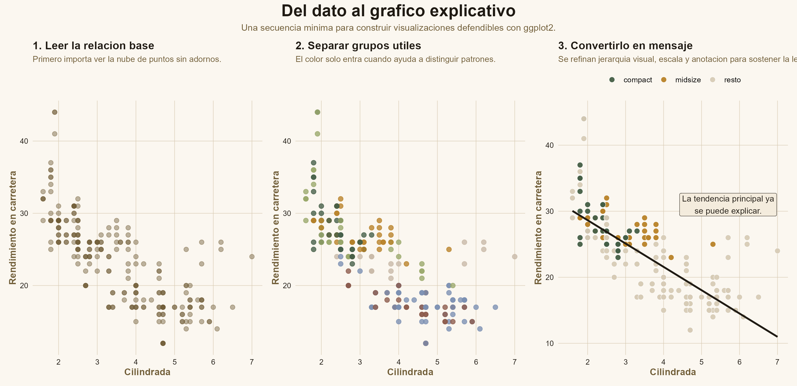

```{=html}
<style>
@import url('https://fonts.googleapis.com/css2?family=Playfair+Display:wght@700;900&family=Source+Sans+3:wght@300;400;600;700&display=swap');

:root {
  --c-bg: #fbf7f0;
  --c-surface: #f0e6d5;
  --c-line: #d6c7af;
  --c-accent: #b88228;
  --c-deep: #1f1a13;
  --c-muted: #7f7360;
  --c-green: #445e46;
}

body {
  font-family: 'Source Sans 3', sans-serif;
  background:
    radial-gradient(circle at top right, rgba(184, 130, 40, 0.16), transparent 28%),
    linear-gradient(180deg, #fcf8f2 0%, #fbf7f0 45%, #f7f1e7 100%);
  color: var(--c-deep);
}

.quarto-title-block,
#title-block-header {
  display: none !important;
}

.landing {
  max-width: 1160px;
  margin: 0 auto;
  padding: 0.5rem 0 3.2rem;
}

.landing-hero {
  display: grid;
  grid-template-columns: minmax(0, 1.02fr) minmax(360px, 0.98fr);
  gap: 2.2rem;
  align-items: center;
  margin-bottom: 2rem;
}

.landing-copy h1,
.landing-copy h2,
.landing-copy h3,
.landing-panel h3,
.landing-wide h2 {
  font-family: 'Playfair Display', serif;
}

.landing-copy p,
.landing-wide p {
  font-size: 1.06rem;
  line-height: 1.78;
}

.landing-steps {
  display: flex;
  flex-wrap: wrap;
  gap: 0.55rem;
  margin: 1rem 0 1.15rem;
}

.landing-step {
  display: inline-flex;
  align-items: center;
  gap: 0.45rem;
  border: 1px solid var(--c-line);
  background: rgba(251, 247, 240, 0.88);
  border-radius: 999px;
  padding: 0.45rem 0.8rem;
  font-size: 0.95rem;
  color: var(--c-deep);
}

.landing-step strong {
  color: var(--c-accent);
}

.landing-actions {
  display: flex;
  flex-wrap: wrap;
  gap: 0.85rem;
  margin: 1.3rem 0 0.95rem;
}

.landing-actions a {
  text-decoration: none;
  border-radius: 999px;
  padding: 0.82rem 1.24rem;
  font-weight: 700;
  transition: transform 0.2s ease, box-shadow 0.2s ease;
}

.landing-actions a:hover {
  transform: translateY(-1px);
}

.btn-primary {
  background: var(--c-accent);
  color: #fffaf2;
  box-shadow: 0 10px 25px rgba(184, 130, 40, 0.24);
}

.btn-secondary {
  background: rgba(240, 230, 213, 0.92);
  color: var(--c-deep);
  border: 1px solid var(--c-line);
}

.landing-card {
  background: rgba(251, 247, 240, 0.88);
  border: 1px solid var(--c-line);
  border-radius: 18px;
  padding: 1rem;
  box-shadow: 0 18px 40px rgba(31, 26, 19, 0.08);
}

.landing-card img {
  width: 100%;
  display: block;
  border-radius: 12px;
}

.landing-grid {
  display: grid;
  grid-template-columns: repeat(4, minmax(0, 1fr));
  gap: 1rem;
  margin-bottom: 1rem;
}

.landing-panel {
  background: rgba(240, 230, 213, 0.78);
  border-top: 4px solid var(--c-accent);
  border-radius: 14px;
  padding: 1rem 1.05rem;
}

.landing-panel h3 {
  margin: 0 0 0.45rem;
  font-size: 1.18rem;
}

.landing-panel p {
  margin: 0;
  line-height: 1.65;
}

.landing-wide {
  display: grid;
  grid-template-columns: 1.2fr 0.8fr;
  gap: 1rem;
  margin-top: 1rem;
}

.landing-note,
.landing-checklist {
  background: rgba(251, 247, 240, 0.86);
  border: 1px solid var(--c-line);
  border-radius: 16px;
  padding: 1.2rem 1.25rem;
}

.landing-checklist ul {
  margin: 0;
  padding-left: 1.2rem;
}

.landing-checklist li + li {
  margin-top: 0.5rem;
}

code {
  background: #f2ebdf;
  color: var(--c-green);
  border: 1px solid var(--c-line);
  border-radius: 4px;
  padding: 1px 5px;
}

@media (max-width: 980px) {
  .landing-hero,
  .landing-grid,
  .landing-wide {
    grid-template-columns: 1fr;
  }
}
</style>

<section class="landing">
  <div class="landing-hero">
    <div class="landing-copy">
      <h1>Un buen gráfico no empieza en el tema final: empieza en la lectura del dato</h1>
      <p>Esta guía está organizada como una secuencia de decisiones. Primero se reconoce la estructura de las variables, luego se elige la comparación central, después se construyen capas con intención y al final se refina el mensaje visual para que el gráfico explique algo con claridad.</p>
      <div class="landing-steps">
        <span class="landing-step"><strong>1.</strong> Leer variables</span>
        <span class="landing-step"><strong>2.</strong> Elegir comparación</span>
        <span class="landing-step"><strong>3.</strong> Construir capas</span>
        <span class="landing-step"><strong>4.</strong> Refinar el mensaje</span>
      </div>
      <div class="landing-actions">
        <a class="btn-primary" href="./guia_proceso_ggplot2.html">Abrir la guía</a>
        <a class="btn-secondary" href="./guia_proceso_ggplot2.pdf">Descargar PDF</a>
      </div>
      <p><strong>Aquí no se trata de memorizar geoms aislados.</strong> La idea es practicar un flujo estable para pasar de una tabla a una visualización que ordene la atención, sostenga comparaciones y comunique una conclusión defendible con <code>ggplot2</code>.</p>
    </div>
    <div class="landing-card">
      
    </div>
  </div>

  <div class="landing-grid">
    <div class="landing-panel">
      <h3>Leer la estructura</h3>
      <p>Antes de graficar, conviene distinguir si la variable es continua, categórica, ordinal o temporal y qué tipo de lectura permite.</p>
    </div>
    <div class="landing-panel">
      <h3>Elegir la forma</h3>
      <p>El tipo de gráfico se decide por la pregunta analítica: comparar, distribuir, relacionar, seguir cambios o mostrar composición.</p>
    </div>
    <div class="landing-panel">
      <h3>Ordenar la jerarquía</h3>
      <p>Color, tamaño, facetas, escalas y etiquetas solo entran cuando ayudan a priorizar la lectura principal del gráfico.</p>
    </div>
    <div class="landing-panel">
      <h3>Cerrar con intención</h3>
      <p>Un gráfico terminado no es solo correcto: guía la vista, reduce fricción interpretativa y deja clara la conclusión importante.</p>
    </div>
  </div>

  <div class="landing-wide">
    <div class="landing-note">
      <h2>Qué vas a practicar en la guía</h2>
      <p>La guía completa desarrolla un recorrido que va desde la gramática mínima de <code>ggplot2</code> hasta decisiones de estilo, composición y narrativa. El foco no está en producir gráficos “bonitos” al final, sino en construir gráficos legibles desde la primera decisión correcta.</p>
      <p>Por eso el documento combina criterios para elegir geoms, ejemplos comparativos, patrones de refinamiento y un atlas de opciones según la estructura de los datos.</p>
    </div>
    <div class="landing-checklist">
      <h2>Preguntas guía</h2>
      <ul>
        <li>¿Qué relación o comparación debe leerse primero?</li>
        <li>¿Qué estética realmente ayuda y cuál solo distrae?</li>
        <li>¿La escala hace visible la magnitud correcta?</li>
        <li>¿El título y las anotaciones dicen qué mirar?</li>
      </ul>
    </div>
  </div>
</section>
```
